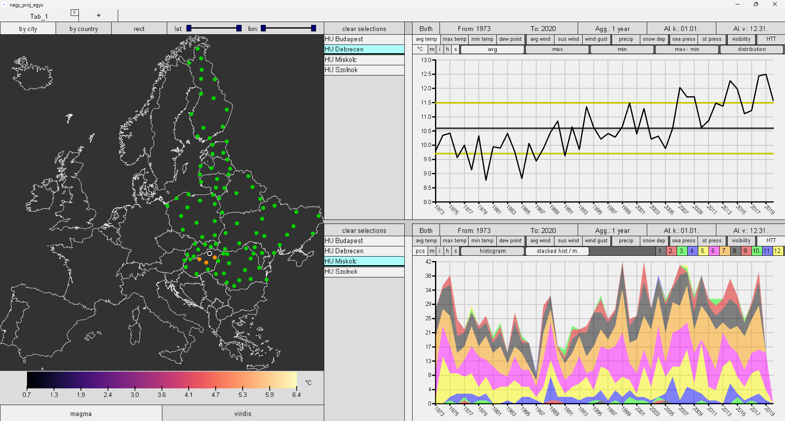

# Climate observer europe

With this software, you can study how climate changed over a part of Europe from 1973 to 2020.

You can run the application by opening and then running the [nagy_proj_egys.pde](datavis_nagy_projekt_CF9PYQ_prog/datavis_nagy_projekt_CF9PYQ_prog/nagy_proj_egys.pde) file with the software named [Processing](https://processing.org/download). It works for sure with Processing version 4.1.1 on Windows.

The data are from the [NOAA NCEI Global Surface Summary of the Day](https://www.ncei.noaa.gov/access/metadata/landing-page/bin/iso?id=gov.noaa.ncdc:C00516).

A screenshot of the app:

